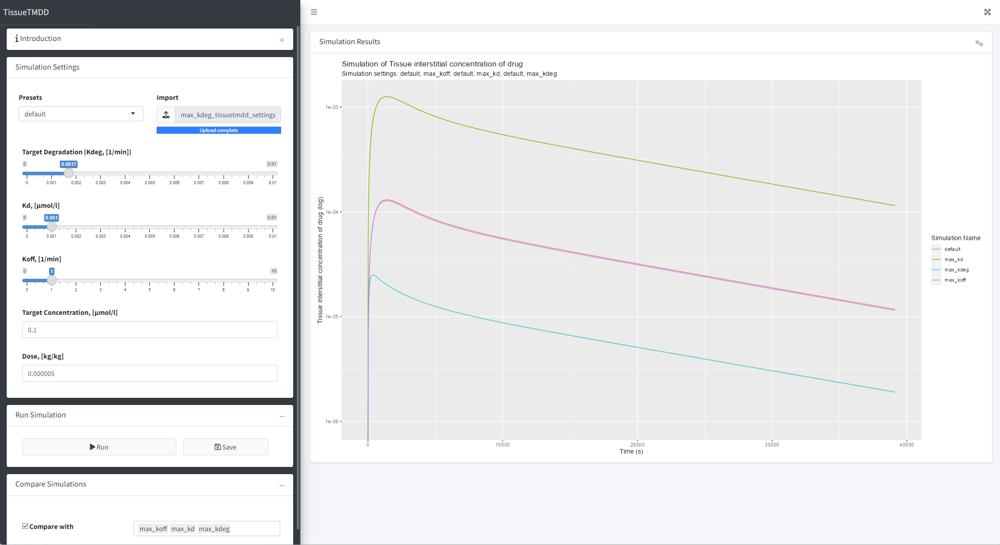

<!-- README.md is generated from README.Rmd. Please edit that file -->

# TissueTMDD

<!-- badges: start -->

[](https://lifecycle.r-lib.org/articles/stages.html#experimental)
<!-- badges: end -->

TissueTMDD is a shiny that provide an interactive way to run simulations
of drug-target binding in tissue interstitial space.

Using TissueTMDD, you can:

- Setup simulation parameters,
- Run simulations,
- Compare simulations,
- Export and import simulation settings



## Installation

You can install the development version of TissueTMDD from
[GitHub](https://github.com/) with:

``` r
# install.packages("devtools")
devtools::install_github("esqLABS/TissueTMDD")
```

## Run the App

``` r
library(TissueTMDD)
run_app()
```

## Code of Conduct

Please note that the TissueTMDD project is released with a [Contributor
Code of
Conduct](https://contributor-covenant.org/version/2/1/CODE_OF_CONDUCT.html).
By contributing to this project, you agree to abide by its terms.
