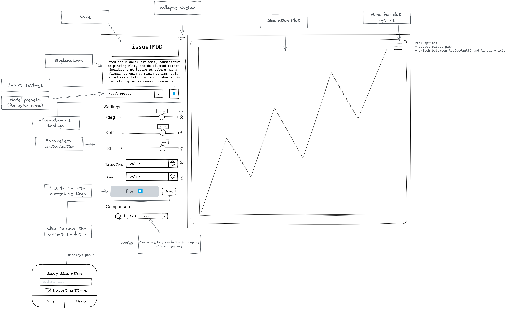

```{r, include = FALSE}
knitr::opts_chunk$set(
  collapse = TRUE,
  comment = "#>"
)
```

# User requirements

As a user, I need TissueTMDD app to be able to:
  
  - Run PK simulation using a preloaded model,
  - Let me customize the simulations by changing value for most the relevant parameters,
  - Pick the output path I want,
  - Export and import simulation settings,
  - Display simulation result as concentration over time plot,
  - Compare at least two simulations results graphically,
  - Compare at least two simulations parameters,
  - Change from log (default) to linear scale on y axis,

  
# Graphical User Interface Prototype



# Technical requirements

The application should:

  - Interact with a .pkml file through OSPS,
  - Be deployable on a server,
  - Be an R package.


